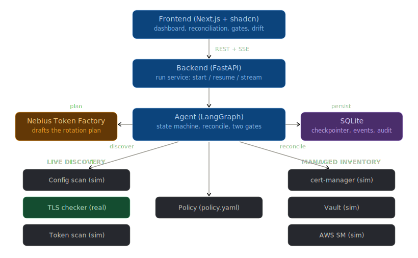

# Unmanaged Credential Sentinel

> An agentic system that finds the credentials no rotation service is tracking, and drives them to a safe, human-approved rotation.

The rotation *mechanism* is a commodity (AWS Secrets Manager, Vault, cert-manager). This agent is the **discovery and decisioning layer** around it: it reconciles live production credentials against what the rotation services actually manage, then safely handles the unmanaged tail that falls through the cracks, with a human gate before any staged credential is created and before every cutover.

**Live demo:** [credential-sentinel.vercel.app](https://credential-sentinel.vercel.app)

---

## Evaluation

This agent ships with a full LangSmith evaluation suite — a 50-case golden dataset, code +
LLM-as-judge evaluators, and measured baseline → improvement deltas (**composite
`0.976 → 1.000`**, including a regression caught and fixed). See **[evals/](evals/)**.

---

## What was built

**Phase 0 (walking skeleton)** — proven plumbing:
- ✅ LangGraph graph with a SQLite checkpointer and **two interrupt gates**
- ✅ Stateless FastAPI over a stateful graph — `run_id == thread_id`, every call resumes from the checkpoint
- ✅ **SSE** live progress backed by a persisted event log (replays on reconnect)
- ✅ Next.js + shadcn/ui frontend: dashboard, activity feed, reconciliation table, approval gates
- ✅ Real-browser Playwright e2e through both gates

**Phase 1 (discovery + reconciliation)**:
- ✅ **Real TLS adapter** — a genuine TLS handshake reads `notAfter` from the live cert (`ssl` + `cryptography`), with bounded retry/backoff. `expired.badssl.com` is detected as really expired; this real expiry feeds the urgency score.
- ✅ `reconcile_coverage` follows the decision tree: in a managed store & rotating → DEFER; in a store but not rotating → OWN_STALE; absent → OWN_UNMANAGED; unreachable/unclassifiable → **UNKNOWN** (escalated, never assumed safe — ADR-4)
- 🟡 Token/config-scan discovery sources are simulated (ADR-3); only TLS performs a real handshake. Discovery adapters are pluggable — each source implements a common interface.

**Phase 2 (assess / prioritize / plan / stage)**:
- ✅ `assess` — days-to-expiry, consumer enumeration, rotation safety (blocks if consumers can't be fully enumerated)
- ✅ `prioritize` — transparent urgency score = f(expiry, blast radius, difficulty), ranked queue (ADR-7)
- ✅ `plan` — **Nebius Token Factory** (Llama 3.3 70B, OpenAI-compatible) drafts the rotation plan; deterministic fallback when no key is configured. Prompt passes credential metadata as untrusted data — injection guard baked in.
- ✅ `stage_and_validate` — bounded retry (policy.yaml) + **staged-but-unhealthy escalation** (live credential left untouched if staging fails)
- ✅ Gate 1 shows urgency + expiry + blast radius + the drafted plan; staging panel shows per-credential outcomes

**Phase 3 (cutover / verify / rollback)**:
- ✅ `cutover` with **delayed-revoke ordering** (ADR-6): promote → repoint → verify, and the old credential is revoked *only after* verification passes
- ✅ **Auto-rollback** — if post-cutover verification fails, consumers repoint back to the still-valid old credential and the run escalates; nothing is lost
- ✅ `CutoverPanel` shows the live sequence and per-credential outcome (cut over vs rolled back)
- ✅ e2e exercises both: one credential cuts over (old revoked), one rolls back on a failed verify

**Phase 4 (memory + report)**:
- ✅ **Coverage drift memory** — each run persists a compact summary; the next run diffs against it to surface newly discovered unmanaged credentials, changed coverage, and items **stuck across cycles**. Rendered in the `DriftPanel`.
- ✅ `report` node — Nebius-written end-of-run narrative + counts (deterministic fallback when no key), shown in the `ReportPanel`
- ✅ Cross-run memory lives in its own SQLite file (`sentinel_memory.db`); the run event log doubles as the audit trail

### TLS mode
`discover` does a real TLS handshake by default. Set `SENTINEL_TLS_MODE=sim` to skip it (offline/deterministic — used by the tests).

---

## Architecture



**Agent pipeline:**
`discover → list_managed → reconcile → assess → prioritize → plan → [Gate 1: approve staging] → stage → [Gate 2: approve cutover] → cutover → report`

**Live discovery sources:**
- Config scan — simulated
- TLS checker — **real** (`ssl` + `cryptography`, genuine handshake)
- Token scan — simulated

**Managed inventory sources (all simulated, pluggable adapters):**
- cert-manager, HashiCorp Vault, AWS Secrets Manager

### Nebius Token Factory (the model call)

The `plan` and `report` nodes call Nebius (OpenAI-compatible, Llama 3.3 70B). Add your key to `backend/.env`:

```
NEBIUS_API_KEY=sk-...           # leave blank to use the deterministic fallback
NEBIUS_MODEL=meta-llama/Llama-3.3-70B-Instruct
```

The client uses `AsyncOpenAI(base_url=NEBIUS_BASE_URL)` — any OpenAI-compatible inference server works as a drop-in, including a self-hosted **vLLM** endpoint (see Deployment below).

---

## Running locally

### Backend (FastAPI + LangGraph) — `:8000`

```bash
cd backend
python3.11 -m venv .venv
.venv/bin/python -m pip install -r requirements.txt
.venv/bin/python -m uvicorn app.main:app --reload --port 8000
```

Headless end-to-end check (no browser, no server):

```bash
cd backend && .venv/bin/python smoke_test.py
```

### Frontend (Next.js) — `:3000`

```bash
cd frontend
npm install
npm run dev
```

`frontend/.env.local` points the UI at the backend (`NEXT_PUBLIC_API=http://localhost:8000`).

Open <http://localhost:3000>, click **Start a new sweep**, approve/reject at Gate 1, approve/reject at Gate 2, and watch it cut over and complete.

### Browser end-to-end test (Playwright)

```bash
cd frontend
npm run e2e        # boots backend + frontend, clicks through both gates, asserts completion
```

> **Storage note:** the LangGraph checkpointer, SSE event log, and cross-run memory each live in a separate SQLite file (`sentinel.db`, `sentinel_events.db`, `sentinel_memory.db`). The checkpointer holds a write lock across interrupt pauses; separate files means each has a single writer and they never contend.

---

## Deployment and serving

See **[DEPLOYMENT.md](DEPLOYMENT.md)** for a full walkthrough of every tool, the reasoning behind each choice, and alternatives considered.

### Docker — full local stack

Both services are containerised. The backend image uses the repo root as build context (so `policy.yaml` is accessible); the frontend uses a multi-stage build.

```bash
# Full stack — backend on :8000, frontend on :3000:
docker compose up

# With self-hosted vLLM inference (requires NVIDIA GPU):
docker compose --profile vllm up
```

The `vllm` profile adds an inference server on `:8001`. Because the backend already uses an OpenAI-compatible client, switching from Nebius to vLLM requires no code changes — just set:
```
NEBIUS_BASE_URL=http://localhost:8001/v1/
```

Build images individually:
```bash
# Backend (from repo root):
docker build -f backend/Dockerfile -t sentinel-backend .

# Frontend (from frontend/ dir):
docker build -f frontend/Dockerfile \
  --build-arg NEXT_PUBLIC_API=https://sentinel-api.fly.dev \
  -t sentinel-frontend frontend/
```

### Fly.io — live backend

Backend is deployed on Fly.io at **https://sentinel-api.fly.dev**.

```bash
brew install flyctl
fly auth login
fly apps create <your-app-name>
fly volumes create sentinel_data --size 2 --region ord   # persistent SQLite storage
fly secrets set NEBIUS_API_KEY=sk-...
fly deploy                                                # reads fly.toml from repo root
```

Endpoints:
- `GET /health` — liveness check
- `GET /metrics` — Prometheus counters + latency histograms for every endpoint
- `POST /api/runs`, `GET /api/runs/{id}/events` (SSE), etc. — full API below

### Vercel — live frontend

Frontend is deployed on Vercel at **https://credential-sentinel.vercel.app**.

Set one environment variable in the Vercel dashboard before deploying:
```
NEXT_PUBLIC_API=https://sentinel-api.fly.dev
```

`NEXT_PUBLIC_*` variables are baked into the JavaScript bundle at build time — setting them after the build has no effect; a redeploy is required.

### Kubernetes

```bash
kubectl apply -f k8s/
```

| Manifest | What it provisions |
|---|---|
| `namespace.yaml` | `sentinel` namespace |
| `configmap.yaml` | Backend env vars (origins, model endpoint, TLS mode) |
| `backend-pvc.yaml` | 2 GB PersistentVolumeClaim for SQLite files |
| `backend-deployment.yaml` | Backend — `replicas: 1`, `strategy: Recreate` (SQLite single-writer constraint) |
| `backend-service.yaml` | Stable internal hostname for the backend |
| `frontend-deployment.yaml` | Frontend — `replicas: 2` (stateless, safe to scale) |
| `frontend-service.yaml` | Stable internal hostname for the frontend |
| `vllm-deployment.yaml` | vLLM inference on a GPU node (nvidia-l4); tolerates GPU taint |
| `vllm-service.yaml` | Internal hostname — point `NEBIUS_BASE_URL` here to switch from Nebius |
| `ingress.yaml` | HTTPS ingress with `proxy-buffering: off` and 3600s timeouts (required for SSE) |

To route the backend to in-cluster vLLM instead of Nebius:
```bash
kubectl patch configmap sentinel-config -n sentinel \
  --patch '{"data":{"NEBIUS_BASE_URL":"http://vllm-service:8000/v1/","NEBIUS_MODEL":"meta-llama/Meta-Llama-3.1-8B-Instruct"}}'
kubectl rollout restart deployment/sentinel-backend -n sentinel
```

> **Horizontal scaling path:** replace `AsyncSqliteSaver` with `AsyncPostgresSaver` (one import change — LangGraph supports both) to remove the `replicas: 1` constraint and allow arbitrary horizontal scaling.

### Latency benchmark

```bash
pip install openai
python scripts/latency_bench.py \
  --url https://sentinel-api.fly.dev \
  --model meta-llama/Llama-3.3-70B-Instruct \
  --api-key $NEBIUS_API_KEY \
  --concurrency 1 4 8 16
```

Measures P50/P95/P99 end-to-end LLM call latency at each concurrency level. Compare against a local vLLM endpoint to see the continuous batching throughput advantage.

---

## API surface

| Method + path | Purpose |
|---|---|
| `POST /api/runs` | Create a run (`run_id = thread_id`); streams the graph to the next interrupt. Returns `{ run_id }`. |
| `GET /api/runs/{id}/events` | SSE stream; replays the persisted log on reconnect. |
| `POST /api/runs/{id}/decisions` | `{ gate, decisions: [{ cred_id, action }] }` → resumes via `Command(resume=...)`. Returns `202`. |
| `GET /api/runs/{id}` | Snapshot: reconciliation, queue, staging results, pending gate. |
| `GET /api/runs` | List runs. |
| `GET /api/runs/{id}/audit` | Audit / event log for the run. |
| `GET /health` | Liveness check. |
| `GET /metrics` | Prometheus metrics. |

---

## Layout

```
backend/
  app/
    main.py              # FastAPI app, CORS, Prometheus /metrics, lifespan-managed graph
    api/runs.py          # run endpoints + SSE
    graph/
      state.py           # SentinelState
      build.py           # build_graph() — compiled graph with 2 interrupt gates
      nodes.py           # all phase nodes: discover → reconcile → assess → prioritize → plan → stage → cutover → report
      scoring.py         # urgency score = f(expiry, blast radius, difficulty)
      memory_logic.py    # coverage-drift diff across runs
      tools/tls.py       # real TLS handshake adapter
    services/
      events.py          # per-run pub/sub + SQLite persistence for SSE replay
      runner.py          # run_segment(): drives the graph to the next gate / completion
      memory.py          # cross-run memory store (sentinel_memory.db)
    core/
      config.py          # env + paths
      nebius.py          # OpenAI-compatible LLM client (plan + report nodes); deterministic fallback
      policy.py          # policy.yaml loader (expiry windows, retry bounds)
  smoke_test.py          # headless end-to-end graph test
frontend/
  app/page.tsx                 # dashboard
  app/runs/[runId]/page.tsx    # run detail
  components/                  # ActivityFeed, ReconciliationTable, ApprovalGate, StagingPanel,
                               # CutoverPanel, DriftPanel, ReportPanel, ui/ (shadcn)
  lib/                         # api.ts, useRunStream.ts (SSE hook), types.ts
  e2e/walking-skeleton.spec.ts # Playwright: clicks through both gates to completion
  playwright.config.ts         # boots backend + frontend for the test
evals/
  golden/cases.json            # 50-case golden dataset
  evaluators.py                # code + LLM-as-judge evaluators
  harness.py                   # local eval runner
  langsmith_eval.py            # LangSmith experiment runner
  results/                     # baseline and improvement experiment outputs
assets/
  architecture.svg             # system architecture diagram
backend/Dockerfile             # production image (build context: repo root)
frontend/Dockerfile            # multi-stage Next.js image (standalone mode for Docker only)
docker-compose.yml             # full local stack; --profile vllm adds self-hosted inference
k8s/                           # Kubernetes manifests: namespace, backend, frontend, vLLM, ingress
fly.toml                       # Fly.io deploy config for the backend
scripts/latency_bench.py       # P50/P95/P99 LLM latency benchmark under concurrent load
policy.yaml                    # expiry windows, rotation strategy, retry bounds (tunable without code changes)
```
