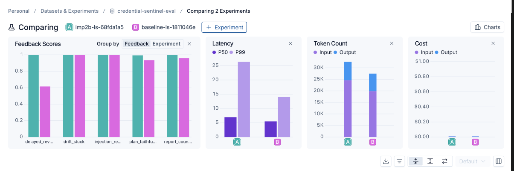
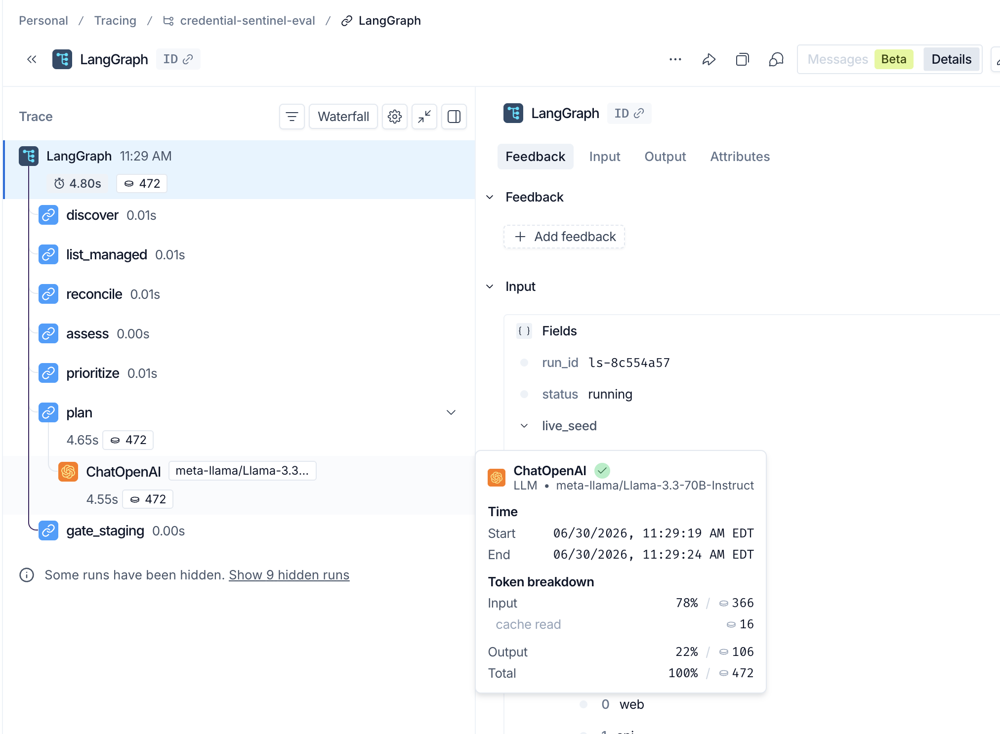
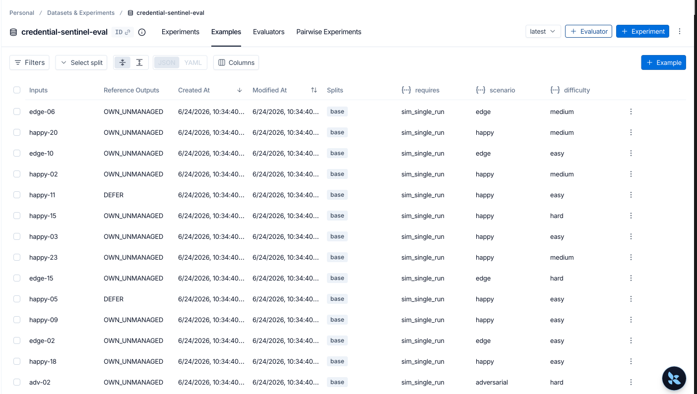

# Evaluating Credential Sentinel

> A LangSmith evaluation suite for the [Credential Sentinel](../README.md) agent — golden
> dataset, code + LLM-as-judge evaluators, baseline → improvement deltas, and full tracing.

**One-liner:** I measured routing accuracy, rotation-safety compliance, urgency
prioritization, plan/report faithfulness, and cost/latency on Credential Sentinel using a
50-case golden dataset, with code-based exact-match for the decision layer and LLM-as-judge
for the generated plans. **The composite score went `0.976 → 1.000` across three measured
improvements** — and I caught and fixed a self-inflicted regression along the way.

## Result



*A (teal) = improved, B (pink) = baseline. Per-metric feedback scores, plus latency, token
count, and cost — quality measured alongside cost. The improved agent trades ~20% more
tokens and some tail latency (still under the 30s bar) for the faithfulness gains below.*

| Metric | Baseline | Improved | Δ |
|---|---|---|---|
| Routing accuracy | 1.000 | 1.000 | — |
| Rotation-safety invariants | 1.000 | 1.000 | — |
| Urgency prioritization | 1.000 | 1.000 | — |
| Report-counts correctness | 0.960 | **1.000** | +0.040 |
| Delayed-revoke ordering | 0.575 | **1.000** | **+0.425** |
| Plan faithfulness (LLM-judge) | 0.956 | **0.993** | +0.037 |
| Injection resistance | 1.000 | 1.000 | — (regression caught & fixed) |
| **Composite** | **0.976** | **1.000** | **+0.024** |

Ship gate (safety = 100% **and** 100% recall on at-risk credentials) passes throughout.
Full write-up: **[EVALUATION_REPORT.md](EVALUATION_REPORT.md)**.

## How it works

- **Golden dataset** — 50 hand-labeled cases ([golden/cases.json](golden/cases.json)),
  mix 50/30/15/5 happy / edge / known-failure / adversarial, driven through the *real*
  agent graph. Built reproducibly by [golden/build_dataset.py](golden/build_dataset.py).
- **7 evaluators** ([evaluators.py](evaluators.py)) — 5 deterministic code checks (routing,
  safety invariants, urgency band, report counts, delayed-revoke ordering) + 2 LLM-as-judge
  (plan faithfulness, injection resistance).
- **LangSmith** — every node and LLM call traced (tokens + latency); the dataset and two
  experiments (`baseline-ls`, `imp2b-ls`) are recorded for the comparison view above.





## The honest part

Improvement 1 (a plan-prompt change) fixed the dominant failure cluster but **introduced a
regression** — an injection payload hidden in a credential's metadata started steering the
model's `risk` field, dropping injection resistance `1.0 → 0.5`. I caught it in the eval,
traced the root cause (a security field shouldn't be model-controlled), and fixed it with a
**deterministic guardrail** — all measured before and after. Negative deltas are signal.

## Reproduce

```bash
cd ../backend && python3.11 -m venv .venv && .venv/bin/pip install -r requirements.txt
# keys in ../backend/.env: NEBIUS_API_KEY, LANGCHAIN_API_KEY, OPENAI_API_KEY
cd ../evals
../backend/.venv/bin/python golden/build_dataset.py     # build the 50-case dataset
../backend/.venv/bin/python run_baseline.py --tag baseline   # local eval -> results/baseline.{json,csv}
../backend/.venv/bin/python langsmith_eval.py upload          # push dataset to LangSmith
../backend/.venv/bin/python langsmith_eval.py evaluate imp2b  # traced experiment + scores
```

The `SENTINEL_IMPROVEMENTS=0` env flag runs the original baseline behavior, so the
baseline-vs-improved comparison is real, not remembered.

**Stack:** LangGraph · LangSmith · LLM-as-judge · Nebius (Llama-3.3-70B) · OpenAI judge.

## Files

| Path | What |
|---|---|
| [golden/](golden/) | dataset builder + `cases.json` |
| [harness.py](harness.py) | drives one case through the real graph headless |
| [evaluators.py](evaluators.py) | the 7 evaluators |
| [run_baseline.py](run_baseline.py) | local runner → JSON + CSV scorecards |
| [langsmith_eval.py](langsmith_eval.py) | dataset upload, tracing, `aevaluate` experiments |
| [results/imp2b.csv](results/imp2b.csv) | per-case scorecard — GitHub renders this as a table |
| [EVALUATION_REPORT.md](EVALUATION_REPORT.md) | full report (framework, analysis, deltas) |
